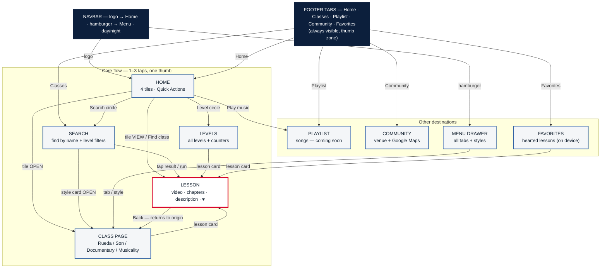

# Rueda Club — Site Map & Navigation Map

One-hand mobile UX reference: every screen, every path, and how many taps each core task costs.

## Screens & paths

## Core tasks — tap cost from Home

| Task | Path | Taps |
|---|---|---|
| Watch today's lesson | Home → tile VIEW | **1** |
| Open a style's classes | Home → style tile OPEN | **1** |
| Open a level's lessons | Home → Level → pick level | **2** |
| Find a move by name | Home → Search → type → tap result | **3** (2 if via footer Classes) |
| Watch a random Foundations tutorial | Home → Find class | **1** |
| Favorite a lesson | Lesson → ♥ | **1** (from anywhere) |
| See only my favorites | Footer → Favorites | **1** |
| Venue directions | Footer → Community → Maps | **2** |

## Keyboard & accessibility map

| Where | Key | Action |
|---|---|---|
| Search field | Enter | run search (opens best match) |
| Search results | ↓ / ↑ | move through results |
| Search results | Enter | open highlighted result |
| Search / drawer | Escape | close results / drawer |
| Every screen | Tab | all controls reachable in DOM order |
| Mobile keyboard | auto | results dropdown flips above input — never hidden under keyboard |

*Search input is 16px — iOS Safari does not zoom on focus. All tap targets ≥ 44px.*

## Routes (shareable URLs)

| Screen | URL |
|---|---|
| Home | `/?tab=home` (default `/`) |
| Search | `/?tab=classes` |
| Levels | `/?tab=levels` |
| Class page | `/?style=style-rueda-de-casino` (also son-cubano, documentary, musicality) |
| Lesson | `/?move=<moveId>&style=<styleId>` |
| Playlist | `/?tab=playlist` |
| Community | `/?tab=community` |
| Favorites | `/?tab=favorites` |

---
*This map is generated from the current code and re-verified after each UI change. Happy to produce it as a spreadsheet of paths or an auto-generated report on request.*